# Formula 1 Fan Web App (Django)
A Django-based fan web application dedicated to Formula 1 2025 season providing detailed information about
drivers, teams, race calendar, statistics, standings and detailed pages.
The project is built as a full-stack web application using Django, PostgreSQL, and Bootstrap, with dynamic content stored in a database.

# Features
Formula 1 drivers & teams pages with detailed profiles
Race calendar with status (completed / next / upcoming)
Statistics of championship progress, fastest laps, pole positions, podiums and dnfs (didn't finish)
Driver & Team standings
Images and data stored in database (fixtures)
Authentication (login / logout)

# Tech Stack
Backend: Django (Python)
Database: PostgreSQL
Frontend: HTML, CSS, Bootstrap, JavaScript
Media & Static: Django static and media files

## Screenshots
The screenshots above demonstrate the main pages and functionality of the Formula 1 fan web application.
All pages are built with Django templates, Bootstrap, and custom CSS, with data loaded dynamically from a PostgreSQL database.

## Home Page
<p align="center">
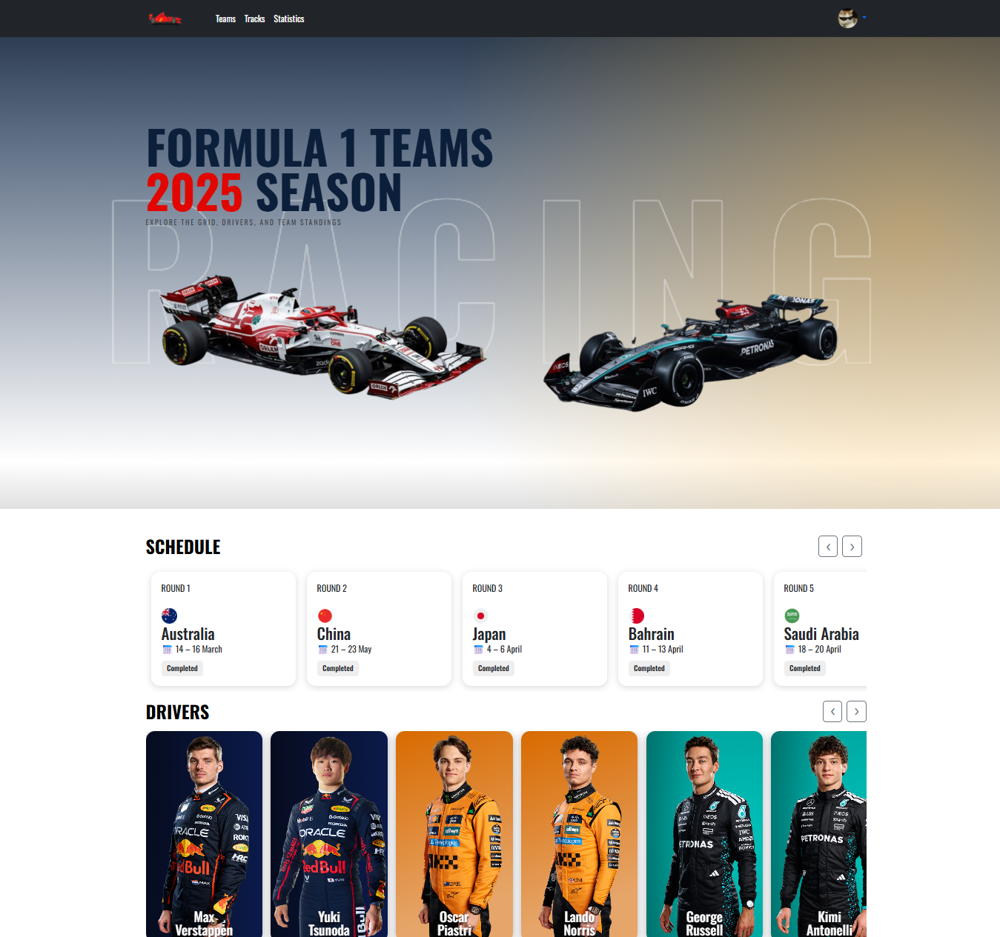
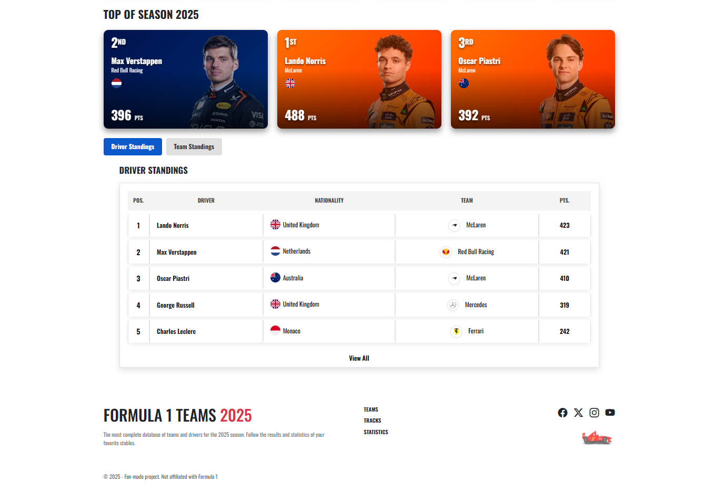
</p>

## Teams Page
<p align="center">
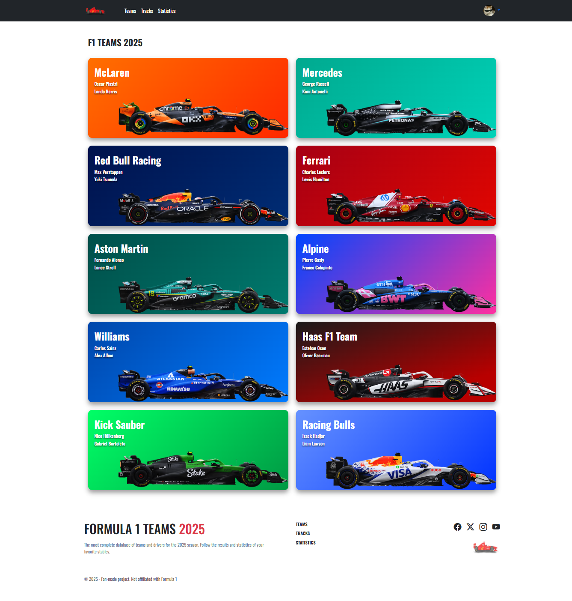
</p>

## Team Details (Different Team Styles)
<p align="center">
  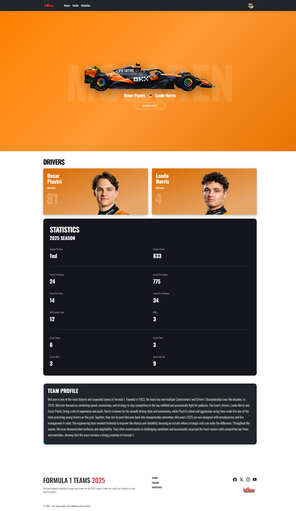
  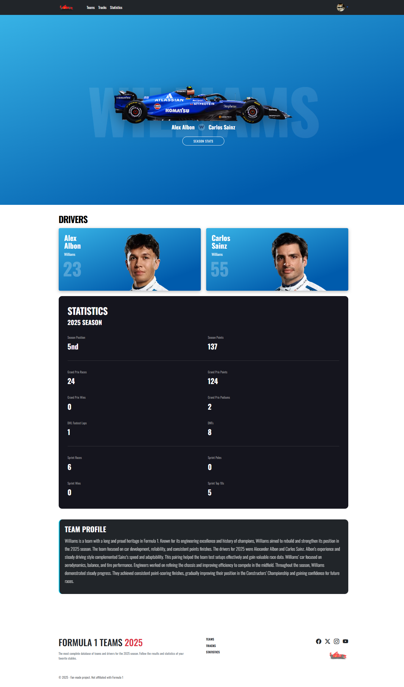
</p>

<p align="center">
  <em>10 team pages generated using Django templates</em>
</p>

## Driver Details (Different Driver Cards)
<p align="center">
  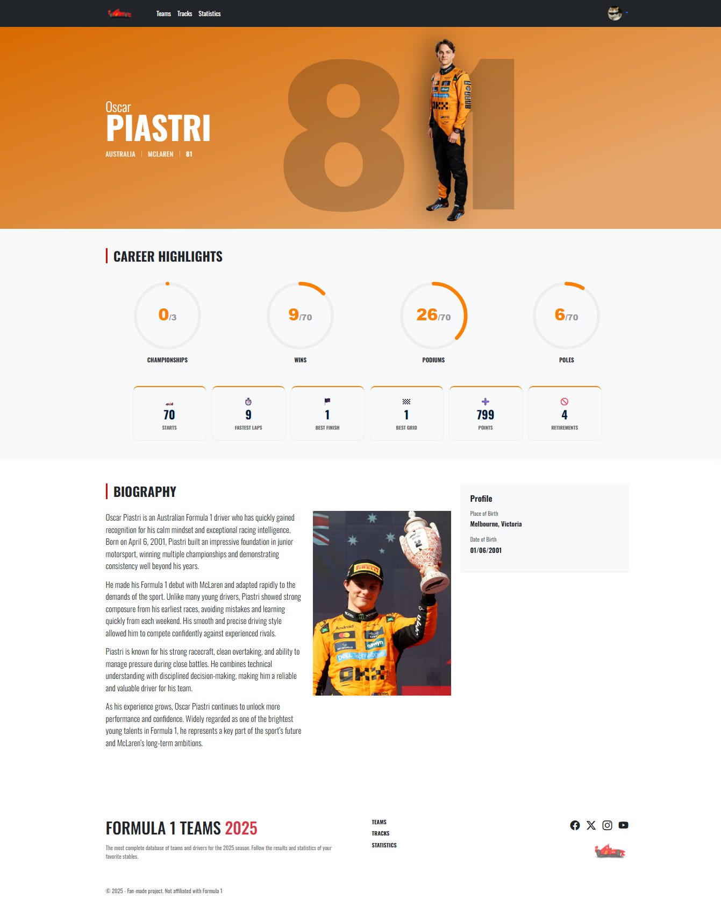
  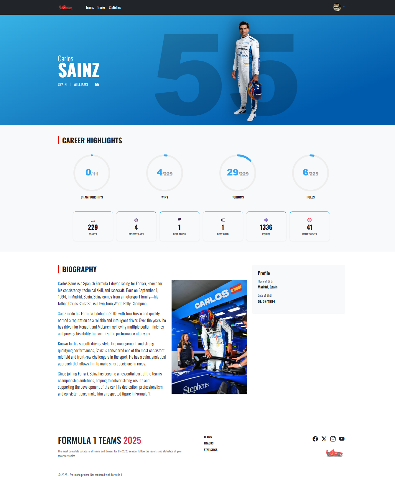
</p>

<p align="center">
  <em>20 driver pages generated using Django templates</em>
</p>

## Tracks
<p align="center">
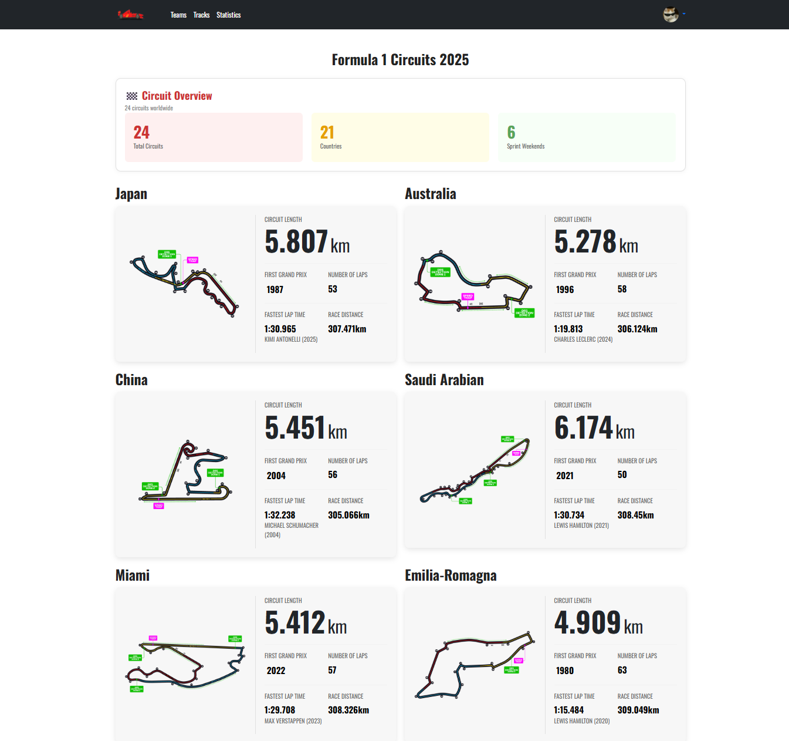
</p>

## Statistics
<p align="center">
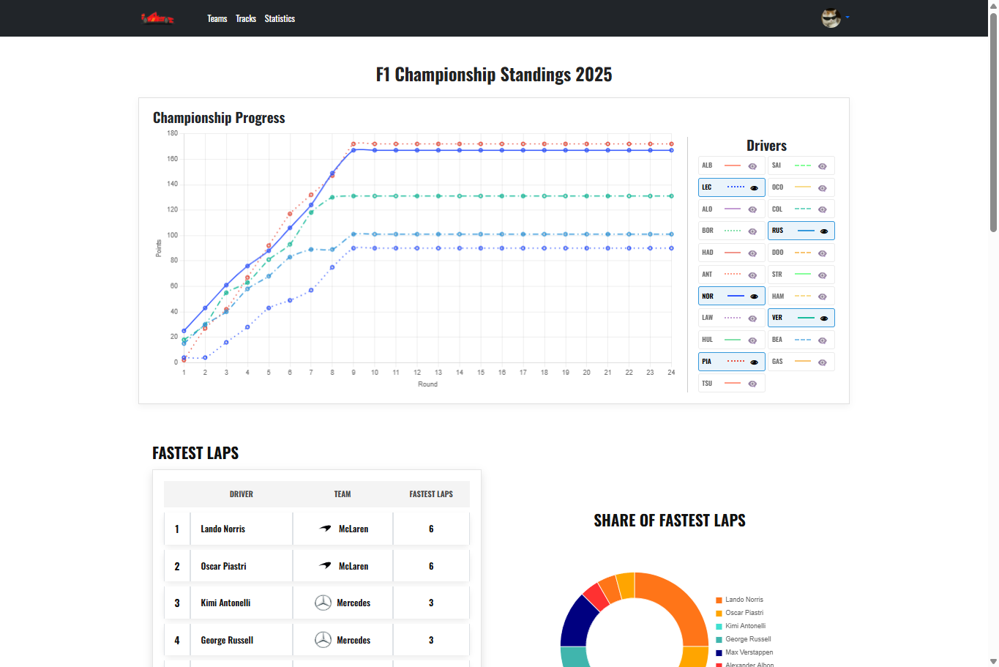
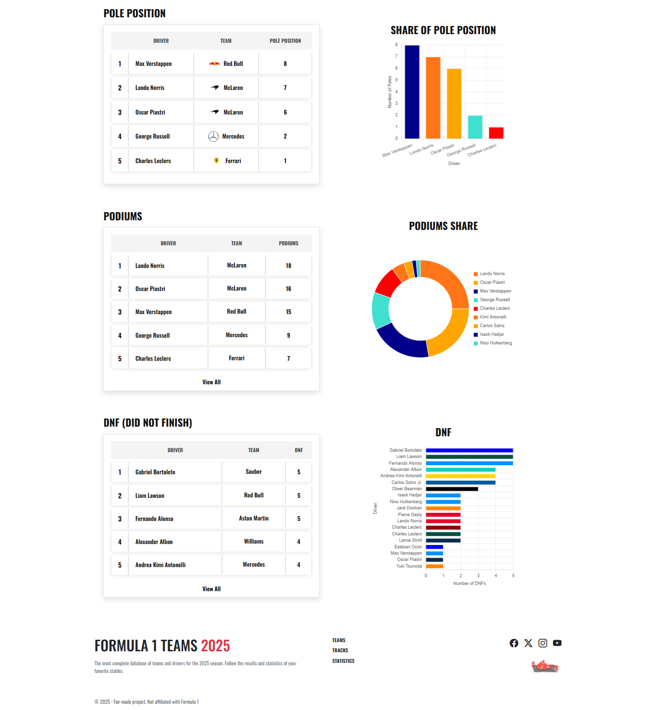
</p>

## Authorization
<p align="center">
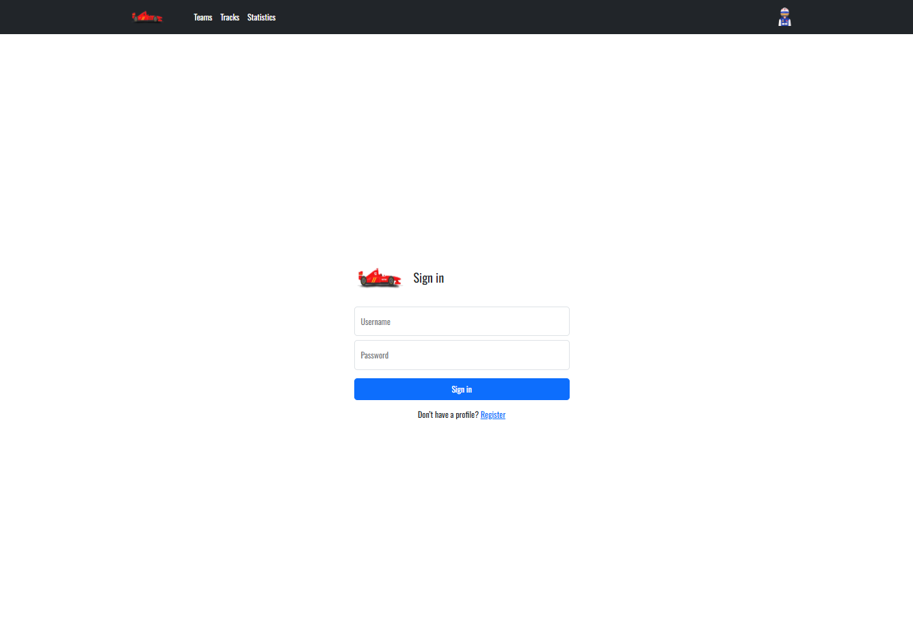
</p>

## User Profile
<p align="center">
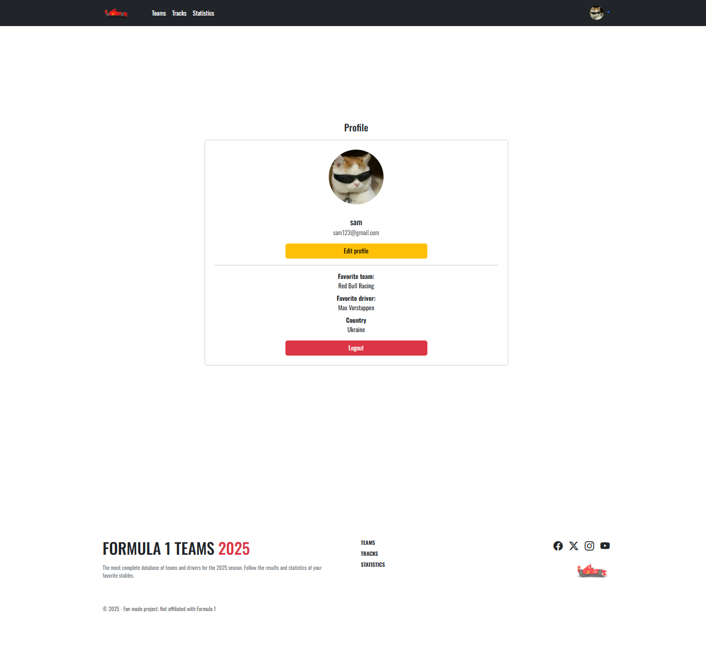
</p>

# Database & Fixtures
The project includes pre-filled database data stored as Django fixtures.
All main content (teams, drivers, statistics, images paths, slugs, texts, etc.) is located in:
```
fixtures/data_site.json
```
This allows the project to be fully restored with the same data after cloning the repository.

# Load data into the database
After applying migrations, load the data using:
```
python manage.py loaddata fixtures/data_site.json
```
(Images are stored locally in static/ and media/ directories and are referenced via database fields.)

# How to Run Locally
## Clone the repository
```
git clone https://github.com/Shyshkanova2005/Django-f1-web-app.git
cd Django-f1-web-app
```

## Install dependencies
```
pip install -r requirements.txt
```

## Configure environment variables
Create a .env file (or set environment variables manually) and add:
```
SECRET_KEY=your-secret-key
```
The SECRET_KEY is not included in the repository for security reasons.

## Apply migrations
```
python manage.py migrate
```

## Load fixtures (database data)
```
python manage.py loaddata fixtures/data_site.json
```

## Run the development server
```
python manage.py runserver
```
